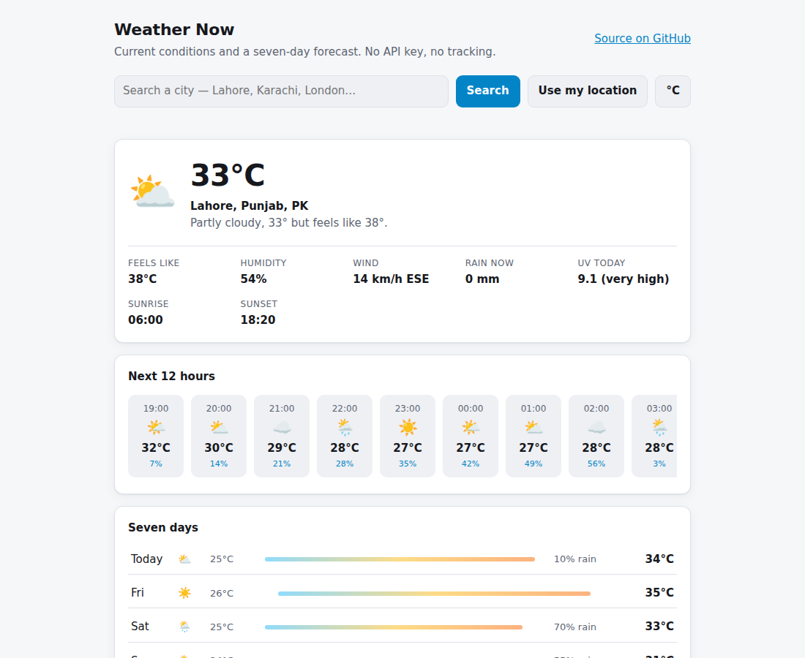

# Weather Now

[](https://github.com/umer-78/weather-now/actions/workflows/ci.yml)


**Live:** https://umer-78.github.io/weather-now/

Current conditions, the next twelve hours and a seven-day forecast, from
[Open-Meteo](https://open-meteo.com/) — which needs no API key and no sign-up.
No framework, no build step, no tracking.



<sub>Screenshot rendered with a fixed sample response so it looks the same every time.</sub>

## Features

- City search with disambiguation (three Lahores? pick the right one) and
  "use my location" through the browser's geolocation
- Feels-like, humidity, wind speed **and compass direction**, rain, UV with the
  WHO advice band, sunrise and sunset
- Hourly strip that starts from **now**, not from midnight
- Seven-day forecast with a temperature range bar and rain chance
- °C / °F toggle, remembered along with your last place
- Light and dark theme, and a layout that works on a phone

## What is tested

`src/weather.js` holds the logic with no DOM in it, so it can be tested with
Node's runner:

```bash
node --test      # 10 tests
```

Covering the WMO weather-code table, temperature conversion and rounding,
compass directions across all four quadrants and negative bearings, UV bands,
wind chill only applying when it is cold and windy, the "feels like" phrasing
rule, and — the one that actually bit — the hourly list starting from the
current hour rather than from the first hour of the day.

## Run it

```bash
git clone https://github.com/umer-78/weather-now.git
cd weather-now
node --test
python3 -m http.server 8080
# open http://localhost:8080
```

## Notes

- Open-Meteo is free for non-commercial use and rate-limited; the page makes one
  forecast call per place, not one per render.
- Geolocation only runs when you press the button, and the coordinates go to
  Open-Meteo and nowhere else.
- `localStorage` is wrapped in try/catch, so private mode degrades to "no saved
  place" instead of a blank page.

## License

[MIT](LICENSE)
